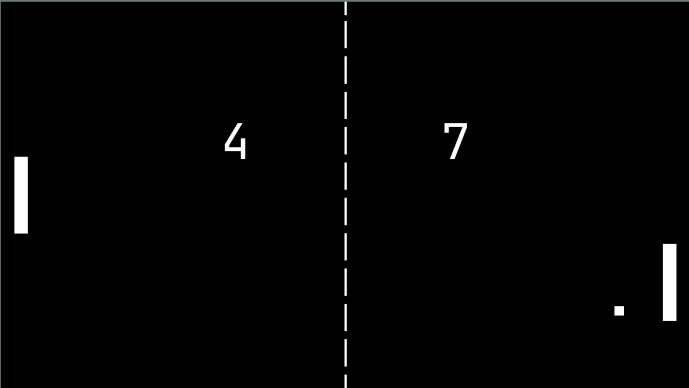

# Classic Pong 👾 
Pong, like in the arcade days.  
It's a two-player game.   
No AI agent yet. :)  

**Controls for Player 1**: <kbd>W</kbd> (up) + <kbd>S</kbd> (down)  
**Controls for Player 2**: <kbd>↑</kbd> (up) + <kbd>↓</kbd> (down)  



# Dependencies

Debian based systems:
```
sudo apt install libsdl2-2.0-0 libgbm1 libsdl2-dev libsdl2-ttf-dev
```

Arch based systems:
```
sudo pacman -S sdl2 sdl2_image
```


# Installation
***NOTE***
only tested / written for linux

Clone the repository:
```
git clone https://github.com/Pieli/pong.git
```
Change directory and compile:
```
cd pong && make
```

# Running the Game ✨
change permission:
```
chmod +x pong
```
run:
```
./pong
```

